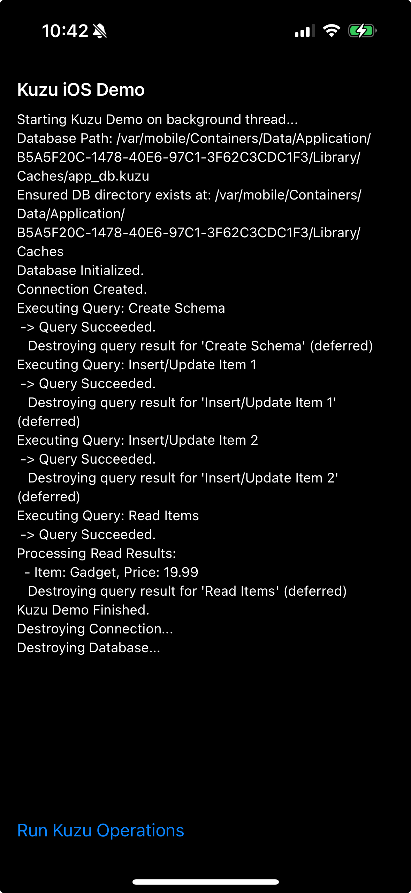

# Kuzu Graph Database iOS Integration Demo

This repository contains a working demo application that integrates the Kuzu graph database with iOS. It demonstrates how to properly set up and use the Kuzu C API in a Swift application.



## Overview

[Kuzu](https://kuzudb.com/) is a high-performance graph database management system. This project shows how to:

1. Properly integrate the Kuzu.xcframework into an iOS application
2. Configure the necessary build settings for successful compilation
3. Create a bridging header to access the C API
4. Write Swift code that interacts with the Kuzu database

## Requirements

- Xcode 14.0 or later
- iOS 15.0 or later
- The Kuzu.xcframework (must be obtained from [github.com/johnbenac/kuzo_ios](https://github.com/johnbenac/kuzo_ios))

## Essential Setup Steps

These were critical for getting the library working on iOS:

1. **Framework Setup**: 
   - Add Kuzu.xcframework to your project
   - Set to "Embed & Sign" in Build Phases

2. **Build Settings**:
   - Add `-lc++` to "Other Linker Flags"
   - Set Framework Search Paths to include `$(PROJECT_DIR)`
   - Set Header Search Paths to include `$(PROJECT_DIR)/**`

3. **Bridging Header**:
   - Create a bridging header with `#import <Kuzu/kuzu.h>`

4. **Resource Configuration**:
   When initializing the database, use iOS-appropriate resource settings:
   ```swift
   let systemConfig = kuzu_system_config(
       buffer_pool_size: 1024 * 1024 * 16, // 16MB 
       max_num_threads: 1, // Just 1 thread for iOS
       enable_compression: true,
       read_only: false,
       max_db_size: 1024 * 1024 * 64, // 64MB limit
       auto_checkpoint: true,
       checkpoint_threshold: 1024 * 1024 // 1MB
   )
   ```

## Example Usage

The repository contains a complete working example showing:
- Database initialization
- Creating a schema
- Inserting data
- Querying data
- Proper resource cleanup

## Building and Running

1. Clone this repository
2. Download the Kuzu.xcframework from [github.com/johnbenac/kuzo_ios](https://github.com/johnbenac/kuzo_ios)
3. Build and run on your iOS device

## Troubleshooting

If you encounter issues:
- Ensure `-lc++` is added to linker flags
- Verify framework and header search paths
- Check that your resource settings match iOS capabilities
- Clean build folder and rebuild

## License

[Specify your license here]

## Acknowledgments

- Thanks to the Kuzu Database team for creating this powerful graph database 